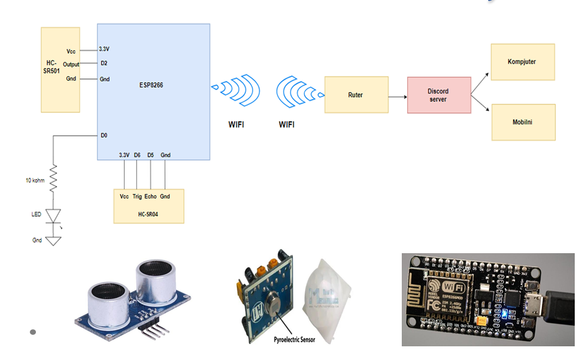

# Using a Discord Server for Networking in IoT

This project demonstrates how a **Discord bot can be used to interact with IoT devices**, specifically an **ESP8266** microcontroller with ultrasonic and PIR sensors. The bot can read sensor data, send alerts, plot measurements, and control devices like an LED, all through Discord commands.

---

## 📌 Features

- **Ultrasonic sensor monitoring**
  - Measure distances and track measurements over time
  - Plot graphs and histograms of collected data

- **PIR motion detection**
  - Detect motion and send alerts to a Discord channel or directly to users

- **LED control**
  - Turn an LED on or off remotely through Discord

- **Role-based command access**
  - Commands are restricted to users with specific Discord roles

- **Direct warnings**
  - Send notifications to server members when thresholds are exceeded

---
